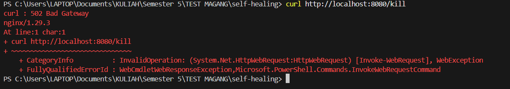
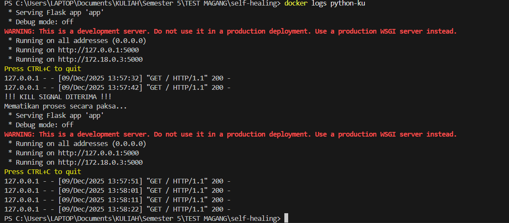
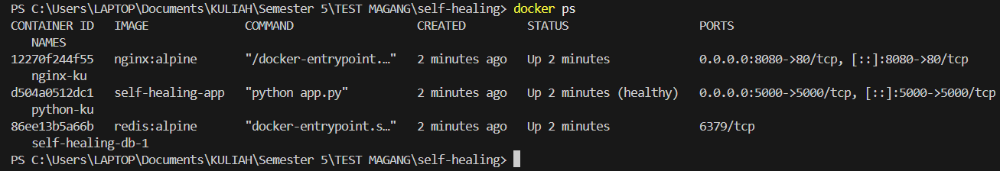

# Self-Healing Infrastructure Challenge 🛡️

> **Container Orchestration & Auto-Recovery System**
>
> *Submission for DevOps & Infrastructure Internship*

## 👨‍💻 Author
**Muhamad Azmi Agil**
*(Focus: DevOps & Infrastructure)*

---

## 📖 Overview
Project ini adalah implementasi konsep **Self-Healing Infrastructure** menggunakan **Docker Compose**. Sistem dirancang memiliki kemampuan **Auto-Recovery**, dimana container aplikasi akan otomatis di-restart oleh orchestrator jika terjadi kegagalan sistem (*crash*).

Arsitektur terdiri dari 3 service utama:
1.  **Nginx (Gateway):** Bertindak sebagai Reverse Proxy / Load Balancer.
2.  **Python Flask (App):** Backend service yang memiliki fitur simulasi *Crash* (`/kill`).
3.  **Redis (Database):** Penyimpanan data NoSQL untuk simulasi koneksi database.

## 🛠️ Tech Stack & Infrastructure Logic
| Component | Technology | Role |
| :--- | :--- | :--- |
| **Orchestrator** | Docker Compose | Mengatur lifecycle container. |
| **Proxy** | Nginx (Alpine) | Meneruskan traffic dari port `8080` ke App. |
| **App** | Python Flask | Backend API. |
| **Database** | Redis (Alpine) | Data store. |

### ⚙️ Self-Healing Mechanism
Fitur otomatisasi yang diterapkan pada `docker-compose.yml`:
1.  **Healthcheck:** Docker melakukan `curl` ke endpoint utama setiap 10 detik.
2.  **Restart Policy (`on-failure`):** Jika aplikasi crash (Exit Code != 0), Docker daemon otomatis me-restart container.
3.  **Dependency Check:** Nginx dikonfigurasi (`depends_on: condition: service_healthy`) agar hanya berjalan ketika App sudah siap.

---

## 🚀 How to Run
Pastikan aplikasi **Docker Desktop** sudah dibuka/berjalan (Running).

1.  **Clone Repository**
    ```bash
    git clone https://github.com/Azmi-Student/self-healing.git
    cd self-healing
    ```

2.  **Start Services**
    ```bash
    docker compose up -d --build
    ```

3.  **Access Application**
    Buka browser atau curl ke: `http://localhost:8080`

---

## 🧪 Simulation & Evidence (Proof of Concept)

Skenario pengujian dilakukan dengan memicu endpoint `/kill` yang memaksa aplikasi berhenti (Exit Code 1). Berikut adalah bukti mekanisme Self-Healing berjalan sukses:

### 1. Trigger Crash (Simulasi Error)
Mengirim request ke endpoint `/kill`.
* **Hasil:** Mendapatkan respon `502 Bad Gateway` (karena Nginx kehilangan koneksi ke App yang baru saja mati).
* **Bukti:**
    

### 2. Auto-Recovery Process (Log Evidence)
Docker mendeteksi aplikasi mati (`KILL SIGNAL DITERIMA`), lalu secara otomatis menghidupkannya kembali (*Serving Flask app*).
* **Bukti:**
    

### 3. Verification (Container Uptime)
Verifikasi menggunakan `docker ps`. Terlihat container `python-ku` sudah berjalan stabil selama 2 menit dan berstatus healthy, sama seperti service lainnya.
* **Bukti:**
    

---

## 📝 Directory Structure
```text
self-healing/
├── nginx/
│   └── default.conf    # Konfigurasi Reverse Proxy
├── app.py              # Python App dengan fitur Kill Switch
├── docker-compose.yml  # Main Orchestration File
├── Dockerfile          # Image Definition
├── requirements.txt    # Python Dependencies
└── README.md           # Documentation